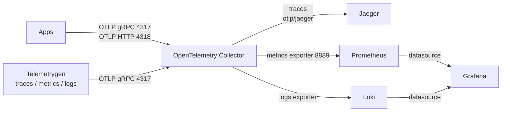

# OpenTelemetry Demo Stack

This repository provides a local observability sandbox for traces, metrics, and logs using OpenTelemetry Collector plus Jaeger, Prometheus, Loki, and Grafana.

## Architecture (Current)

Core services in `docker-compose.yml`:

- `otel-collector` (`otel/opentelemetry-collector-contrib:0.87.0`)
- `jaeger` (`jaegertracing/all-in-one`)
- `prometheus` (`prom/prometheus`)
- `loki` (`grafana/loki`)
- `grafana` (`grafana/grafana`)

Optional telemetry generators (defined, but disabled by default with `scale: 0`):

- `telemetrygen-traces`
- `telemetrygen-metrics`
- `telemetrygen-logs`

Telemetry flow:

- Apps or generators send OTLP to Collector (`4317` gRPC / `4318` HTTP).
- Collector pipelines route:
  - traces -> `otlp/jaeger` (`jaeger:4317`) + `debug`
  - metrics -> `prometheus` exporter (`:8889`) + `debug`
  - logs -> `loki` exporter (`http://loki:3100/loki/api/v1/push`)
- Prometheus scrapes Collector endpoints:
  - internal Collector metrics: `otel-collector:8888`
  - exported metrics endpoint: `otel-collector:8889`



## Exposed Ports

- Collector OTLP gRPC: `4317`
- Collector OTLP HTTP: `4318`
- Collector internal metrics: `8888`
- Collector Prometheus exporter metrics: `8889`
- Collector health check: `13133`
- Collector zPages: `55679`
- Jaeger UI: `16686`
- Jaeger gRPC collector: `14250`
- Jaeger HTTP collector: `14268`
- Jaeger Zipkin-compatible ingest: `9411`
- Prometheus UI: `9090`
- Loki API: `3100`
- Grafana UI: `3000`

Note: Collector `pprof` extension is enabled on `1777` but not published to the host in Compose.

## Repository Structure

```text
.
├── docker-compose.yml
├── otel-collector-config.yaml
├── prometheus.yml
├── loki-config.yaml
├── LICENSE
└── README.md
```

## Usage

1. Start core stack:

```bash
docker compose up -d
```

2. (Optional) Start telemetry generators:

```bash
docker compose up -d telemetrygen-traces telemetrygen-metrics telemetrygen-logs
```

3. Check status:

```bash
docker compose ps
```

4. Stop everything:

```bash
docker compose down
```

## Access

- Jaeger: http://localhost:16686
- Prometheus: http://localhost:9090
- Grafana: http://localhost:3000 (login: `admin` / `admin`)
- Loki API: http://localhost:3100

## OTLP Endpoints for Your Apps

- gRPC: `localhost:4317`
- HTTP: `http://localhost:4318`

## Configuration Notes

- Collector receivers: OTLP gRPC + HTTP
- Collector processors: `memory_limiter`, `batch` (`resourcedetection` is defined but not wired into pipelines)
- Collector extensions: `health_check`, `pprof`, `zpages`
- Prometheus config scrapes only Collector endpoints (not app endpoints directly)
- Loki runs with local filesystem + boltdb-shipper settings for development

## Troubleshooting

- Collector not running: `docker logs otel-collector`
- No traces in Jaeger: confirm `otel-collector` can reach `jaeger:4317` and traces generator is running
- No metrics in Prometheus: check http://localhost:9090/targets
- No logs in Loki/Grafana: confirm logs generator is running and Collector logs pipeline is healthy
- Generators not sending data: they are disabled by default; start them explicitly

## References

- OpenTelemetry Collector: https://opentelemetry.io/docs/collector/
- Telemetrygen: https://github.com/open-telemetry/opentelemetry-collector-contrib/tree/main/cmd/telemetrygen
- Jaeger: https://www.jaegertracing.io/
- Prometheus: https://prometheus.io/
- Loki: https://grafana.com/oss/loki/
- Grafana: https://grafana.com/
